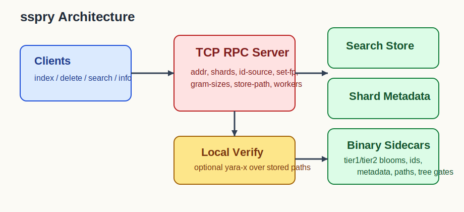
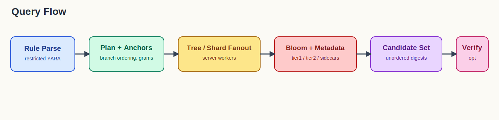
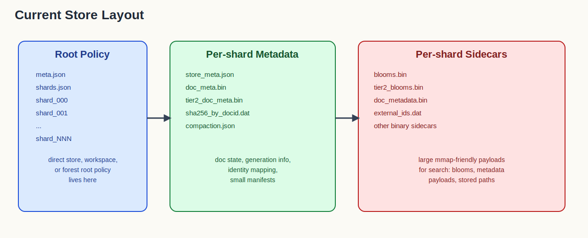

# Implementation

`sspry` is a mutable file-search engine built around per-document bloom filters, compact metadata sidecars, and optional local YARA verification.

## Architecture

At a high level:

1. `serve` starts the TCP server and owns either a mutable workspace/local root or direct tree root, or a read-only forest root.
2. `index` scans files client-side and sends batched documents.
3. The server stores:
   - per-document Tier1 bloom filters
   - per-document Tier2 bloom filters
   - metadata and optional stored file paths
4. `search` or `local search` compiles restricted YARA into one or more named query plans from the top-level expanded source.
5. The store returns candidate digests.
6. If `--verify` is enabled, the client reopens stored file paths and verifies matches locally with `yara-x`.

Public interactive search now has two execution modes:

- RPC mode: query one or more running `serve` processes via `--addr`
- local forest mode: query one forest root in-process via `local search --root`

RPC mode itself now has two useful server shapes:

- mutable workspace/local-root or direct-tree-root servers for remote ingest and query
- forest-root servers that open `tree_*/current` read-only and answer one RPC query across the whole forest

Local forest mode opens each `tree_*/current` store, validates compatible forest policy, and can query trees concurrently with `--search-workers`.

RPC `serve --search-workers` uses a different scheduler than local forest mode: it fans out over concrete search work units, one per shard in direct/workspace mode and one per `(tree, shard)` pair in forest mode.

## Query Flow

The query path is:

1. Parse restricted YARA into fixed literals / boolean structure.
2. Extract Tier1 and Tier2 grams from the rule using the DB-wide gram sizes.
3. Build an anchor plan with branch ordering, per-pattern anchor reduction, and preserved selected anchor literals.
4. Build runtime query artifacts from the compiled plan so bloom checks can hash grams during evaluation instead of storing a full query-side bloom image.
5. Query trees in parallel when searching a forest.
6. Scan shard stores directly.
7. Use per-document Tier1 and Tier2 blooms plus stored metadata to refine candidates.
8. Collect candidate digests without ranking guarantees.
9. Optionally verify file paths locally.

In local forest mode, the query path adds one layer above shard search:

1. open all tree stores under the forest root
2. validate that gram sizes, identity source, and shared search policy match across trees
3. build one compiled plan against the shared forest policy
4. fan out the query across trees with up to `search_workers`
5. merge candidate identities, query profiles, and optional external ids

When one top-level rule file expands to multiple searchable rules, `local search` still opens the forest once, validates shared policy once, and then reuses that opened forest while executing each named rule in source order.

## Storage Layout

Each tree store is hash-sharded by document identity.

Shared policy metadata is written once as `meta.json`:

- at the direct tree root for standalone mutable tree roots
- at the workspace/local root for mutable workspace or local roots
- at the forest root for `tree_*/current` forests

Each direct tree root or published tree root keeps its own `shards.json`.

Per shard, the implementation persists sidecars such as:

- `store_meta.json`
- `doc_meta.bin`
- `tier2_doc_meta.bin`
- `source_id_by_docid.dat` storing one raw source-id digest per doc id
  - row width follows the forest `id_source` (`md5` 16, `sha1` 20, `sha256` 32, `sha512` 64 bytes)
- `doc_metadata.bin`
- `blooms.bin`
- `tier2_blooms.bin`
- `external_ids.dat` when `--store-path` is enabled

Each shard also keeps a small compaction manifest beside the shard root.

The open/search path is intentionally lazy:

- bloom blobs are not materialized for all docs up front
- sidecars are viewed through lightweight metadata plus mmap/lazy reads
- external ids are loaded when needed

That is what keeps search RAM bounded compared with eager whole-store reconstruction.

## Delete, Compaction, and Reclaim

Deletes are immediate logically:

- the document is marked deleted
- query paths stop returning it

Physical reclaim is deferred.

For mutable workspaces, delete semantics are `current`-only:

- deletes are applied against the published `current/` store set
- documents that exist only in `work_a/` or `work_b/` are treated as `missing`
- that `missing` result is normal, especially when one client fans delete requests out to many servers and only some of them actually hold the file

Compaction for delete reclaim also runs against `current/`, not `work_*`.

This section applies to mutable workspace/local roots and direct tree roots. Forest-root servers are read-only views over published `tree_*/current` stores and do not expose ingest/delete/publish.

Each shard now keeps a small compaction manifest with:

- current generation id
- retired generation roots waiting for deletion

Compaction runs shard-local and copy-on-write:

1. snapshot one shard
2. rebuild that shard using live docs only
3. write the rebuilt shard beside the current one
4. atomically swap the rebuilt shard into place
5. move the old shard root into a retired generation path
6. garbage-collect retired generation roots later

Search remains available during the expensive rebuild phase because compaction does not rewrite the live shard in place.

Current limitation:

- this is not full MVCC yet
- there is still a brief lock during final shard swap/reopen
- generation retirement is simpler than a fully mature generation manager

## Identity Model

The server decides identity at store creation time:

- `sha256`
- `md5`
- `sha1`
- `sha512`

The persisted identity width follows the configured `id_source`: `md5` stores
16 bytes, `sha1` stores 20 bytes, `sha256` stores 32 bytes, and `sha512`
stores 64 bytes. The configured source-id value is the canonical document
identity used for insert deduplication, delete, search identity matches, and
forest-wide deduplication.

Important consequence:

- clients do not choose identity type
- ingest and delete both follow the server's configured `--id-source`

## Source ID Deduplication

Insert-time duplicate detection is Tree-local and uses the configured Source ID.
That prevents duplicate Source IDs within the same Tree, but a mutable Forest can
temporarily contain duplicates across different Trees.

Forest-wide deduplication is handled as idle maintenance:

1. build or refresh sorted per-Tree Source ID reference files
2. merge those sorted references across the Forest
3. keep the oldest Tree entry for each Source ID
4. mark duplicates in newer Trees as deleted

The maintenance pass is gated by `init --dedup-min-docs`, which defaults to
`1000`. It does not run during active indexing/search work. Search clients also
deduplicate returned Source IDs, so temporary cross-Tree duplicates should not
produce duplicate result identities.

## Gram Model

`--gram-sizes <tier1,tier2>` is a DB-wide format choice.

Supported pairs:

- `3,4`
- `4,5`
- `5,6`
- `7,8`

Rules:

- the first value is the Tier1 gram size
- the second value is the Tier2 gram size
- the choice is persisted in metadata
- stores must be queried with the same gram model they were created with

## Ingest Path

Client-side indexing does the expensive file scan and feature extraction before sending batches.

For each file, the client computes:

- normalized document id
- Tier1 bloom grams
- Tier2 bloom grams
- file size
- optional stored path

Remote indexing uses:

- document-count batching
- request-size-aware splitting
- automatic retry/bisection when a serialized request exceeds the RPC cap

That keeps large ingest runs from failing on a single oversized batch.

## Search Planning

The planner compiles rules into a restricted query tree and chooses anchor grams.

Current search improvements include:

- OR branch ordering by estimated selectivity
- duplicate OR subtree and alternative dedup
- dynamic shard scheduling across server search workers
- bounded server-side query-result cache
- runtime query-artifact cache inside the store
- per-rule runtime query-artifact memory profiling
- bundled runtime-hash evaluation for multi-rule local sweeps
- preserved selected anchor literals for runtime lane selection so chosen anchors do not silently degrade into broad any-lane matching

These are intended to be recall-safe planner/runtime improvements.

The planner also now has explicit fail-fast boundaries for structurally bad large-corpus rules:

- high-fanout unions with no mandatory anchorable pattern
- low-information `verifier_only_at` / entry-point stub rules
- short range/suffix rules where the only searchable literals are tiny near-EOF anchors

Those are not treated as searchable/good rules because the engine would otherwise be forced into near-full scans or recall-risky heuristics.

The planner also treats Tier2-only searchable patterns as anchorable for these structural checks. That keeps tier2-anchorable rules from being rejected just because they do not contribute Tier1 grams.

## Verification Model

Search without `--verify` returns candidate digests.

Candidate order is not part of the search contract. The current runtime preserves match-set semantics, not ranked or deterministic ordering.

Search with `--verify`:

1. requires stored paths (`--store-path` at `init` time)
2. reopens candidate files locally
3. runs `yara-x` verification
4. returns verified matches as an unordered set

This means verified search quality depends on:

- candidate quality from the store
- stored paths remaining valid
- files still existing on disk

## Current Known Gaps

These are the main implementation gaps worth keeping in view:

- compaction is shard-local and working, but it is not yet a full multi-generation MVCC design
- long-lived store cleanup and sweep behavior need another pass
- short common literals and tiny wildcard-heavy hex stubs are still the hardest precision cases because the engine is gram-based and mostly non-positional
- some advanced search-planner ideas are still not implemented, especially stronger first-scan selectivity for broad-but-valid rules
- shutdown drains existing requests, rejects new mutations during drain, and is available both by signal and explicit RPC/CLI command

## Why The Design Looks Like This

The current tradeoffs are deliberate:

- mutable store instead of rebuild-only index
- bloom tiers and compact metadata instead of retained exact gram postings
- server-owned store policy so clients stay simple
- narrow public CLI so alpha users only touch meaningful knobs
